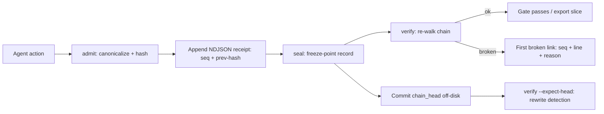

# LatticeAG VisReceipt 🧾

<p align="center">
  <a href="https://github.com/LatticeAG/visreceipt/blob/main/LICENSE">
    
  </a>
  <a href="https://github.com/LatticeAG/visreceipt/actions/workflows/ci.yml">
    
  </a>
  <a href="https://github.com/LatticeAG/visreceipt/stargazers">
    
  </a>
  <a href="https://github.com/LatticeAG/visreceipt/issues">
    
  </a>
  <a href="https://github.com/LatticeAG/visreceipt">
    
  </a>
  <a href="https://www.npmjs.com/package/@latticeag/visreceipt">
    
  </a>
  <a href="https://nodejs.org/">
    
  </a>
</p>

<p align="center">
  <b>Attested evidence ledger for agent actions. Hash-chained, tamper-evident, append-only.</b><br/>
  Every agent record gets a receipt. The CLI names the first broken link.
</p>

<p align="center">
  <a href="#quick-start">Quick Start</a> ·
  <a href="#why-visreceipt">Why VisReceipt</a> ·
  <a href="#how-it-works">How It Works</a> ·
  <a href="#features">Features</a> ·
  <a href="#configuration">Configuration</a> ·
  <a href="#file-tree">File Tree</a>
</p>

---

`@latticeag/visreceipt` (v`0.1.0`) hash-chains agent records into an append-only NDJSON `.vrc` file. The `visreceipt` CLI verifies the chain and reports the first broken link by `seq`, line, and `reason`.

Built by [LatticeAG](https://github.com/LatticeAG).

## Why VisReceipt

- **Agent logs are mutable; receipts aren't** - each record links to the previous hash, so silent edits, deletions, or reorderings break the chain at an exact, named link.
- **Pin the head off-disk** - `verify --export --expect-head` checks the chain against a committed `chain_head` stored elsewhere, closing the rewrite-the-whole-file loophole.
- **Sealed sessions** - `assertSealed`/`gate` require a matching freeze-point seal before downstream automation proceeds.
- **Redacted by default** - `inspect` redacts unless run on a TTY with `VISRECEIPT_ALLOW_UNREDACTED=1`.
- **Sidecar-native** - the recorder stays VisReplay; the sidecar for `session.vrs` is `session.vrs.vrc` (`sidecarPath(p)` is `p + ".vrc"`).

### How VisReceipt is different

- **Tamper-evident, honestly scoped** - v1 has no signing keys and claims none: an operator who rewrites the whole file, genesis included, gets a new internally consistent chain. The documented answer is a committed off-disk `chain_head`, not crypto theater.
- **Conformance-pinned** - `conformance/tamper` carries 15 tamper cases (T01–T15) plus a golden NDJSON; the suite proves each attack is caught at the right link.
- **Gate-aware** - receipts plug into deployment gates (`gate --ledger … --subject-id … --freeze-point session_end`), not just post-hoc forensics.

## Quick Start

```bash
# 1. Install (Node >= 20)
npm install @latticeag/visreceipt

# 2. Seal a session, verify it
visreceipt seal --from-vrs session.vrs
visreceipt verify session.vrs.vrc
visreceipt doctor   # prints ok when the local runtime is healthy

# 3. Pin the head off-disk, then enforce it
visreceipt verify session.vrs.vrc --expect-head <hex>
visreceipt export session.vrs.vrc --from-seq 1 --to-seq LAST --out slice.json
visreceipt verify --export slice.json --expect-head <hex>
```

SDK:

```ts
import { ReceiptLedger, attachReceipts, sidecarPath, assertSealed } from "@latticeag/visreceipt";
import { VisReplay } from "@latticeag/visreplay";

const recorder = new VisReplay({ sessionName: "deploy-staging", agentType: "custom" });
attachReceipts(recorder);
const agent = recorder.wrap(myAgent);
await agent.run("Deploy to staging");
recorder.end();
await recorder.save("sessions/deploy-staging.vrs");
// sidecar sessions/deploy-staging.vrs.vrc now exists

const ledger = await ReceiptLedger.open("sessions/deploy-staging.vrs.vrc");
const verified = await ledger.verify();
if (!verified.ok) throw new Error(verified.broken_at!.reason);
await assertSealed(ledger, { freeze_point: "session_end", subject_id: recorder.getSession().sessionId });
```

## How It Works



## Features

### Core

| Feature | Description |
|---------|-------------|
| **Hash-chained ledger** | `ReceiptLedger` appends canonicalized (JCS) records; each links to the previous hash. |
| **First-broken-link verify** | `verify` stops at the first broken link and names it by `seq`, line, and `reason`. |
| **Seals & freeze points** | `seal` appends a freeze record; `assertSealed`/`gate` require it before proceeding. |
| **Subchain export** | `export --from-seq/--to-seq --out` writes a `visreceipt/export/1.0` slice (mode `0o600`); `verifyExport` checks it. |
| **Head pinning** | `--expect-head <hex>` detects whole-file rewrites against an off-disk `chain_head`. |
| **Directory watch** | `watch <dir>` seals sidecars for new `.vrs` files. |
| **Crash tail** | `crash_tail` recovers the writable tail after an unclean shutdown. |
| **Rotation** | `rotate` rolls ledgers without breaking verifiability. |
| **VRS attach** | `attachReceipts(recorder)` + `sidecarPath` wire receipts onto a VisReplay recorder. |

### CLI

```bash
visreceipt seal --from-vrs session.vrs
visreceipt verify session.vrs.vrc
visreceipt verify session.vrs.vrc --expect-head <hex>
visreceipt export session.vrs.vrc --from-seq 1 --to-seq LAST --out slice.json
visreceipt verify --export slice.json --expect-head <hex>
visreceipt inspect session.vrs.vrc --head
visreceipt inspect session.vrs.vrc --seq 42 --vrs session.vrs
visreceipt gate --ledger session.vrs.vrc --subject-id SESSIONID --freeze-point session_end
visreceipt doctor
```

`export --out` writes mode `0o600`. `inspect --no-redact` needs a TTY and `VISRECEIPT_ALLOW_UNREDACTED=1`. `gate --soft` prints the error and still exits 0. `exportRange` and `inspect` live on `ReceiptLedger`; `verifyExport` checks a `visreceipt/export/1.0` slice.

`assertSealed` throws `VRC2001` if the freeze is missing, `VRC2003` if the seal is older than `max_age_ms` (default 300000, `0` skips age), and `VRC2004` if the chain is not ok. It does not run tools.

## Configuration

Config file is `visreceipt.json`: UTF-8, LF, no comments. The loader walks parents from cwd; `VISRECEIPT_CONFIG` overrides the path. Unknown keys fail the load.

```bash
visreceipt doctor                    # ok = healthy
visreceipt gate --ledger session.vrs.vrc --subject-id SESSIONID --freeze-point session_end
visreceipt gate --soft --ledger session.vrs.vrc --subject-id SESSIONID --freeze-point session_end  # warn-only
```

Peer `@latticeag/visreplay` is optional — `--from-vrs` still parses `visreplay/session/1.0` without it.

## Verification

```bash
pnpm install
pnpm build    # tsc -p tsconfig.build.json
pnpm test     # vitest run
pnpm check    # tsc --noEmit && vitest run
```

Test suite (verified): **86 passed, 0 failed across 17 test files** — chain (9), tamper (17 cases T01–T15 + golden), admit (7), errors (9), ledger, config, export, gate, inspect, JCS, redact, crash-tail, rotate, VRS parse, attach, CLI.

Conformance fixtures: `conformance/chain` (genesis, link, seal), `conformance/jcs` (self-tests), `conformance/tamper` (T01–T15 + `golden.ndjson`).

## File Tree

```
src/
  ledger.ts       ReceiptLedger: open/append/verify/exportRange/inspect
  chain.ts        hash-link construction + verification
  admit.ts        canonicalize + admit records
  seal/gate       freeze-point seals + gate enforcement (gate.ts)
  export.ts       visreceipt/export/1.0 subchain slices + verifyExport
  inspect.ts      head / seq inspection (redacted by default)
  vrs.ts          visreplay/session/1.0 parsing + --from-vrs
  attach.ts       attachReceipts(recorder) sidecar wiring
  watch.ts        directory watch for .vrs sidecars
  jcs.ts          JSON canonicalization
  redact.ts       redaction rules
  rotate.ts       ledger rotation
  crash_tail.ts   unclean-shutdown tail recovery
  repair.ts       repair helpers
  config.ts       visreceipt.json loader
  errors.ts       VRC error codes (VRC2001/VRC2003/VRC2004)
  cli.ts          visreceipt binary (version/seal/verify/export/inspect/gate/doctor/watch)
conformance/      chain + jcs + tamper (T01-T15, golden.ndjson)
dist/             built output (tsc)
```

## Known Issues

- **Tamper-evident, not tamper-proof** - no signing keys in v1. A whole-file rewrite (genesis included) yields a new consistent chain; only a committed off-disk `chain_head` catches it.
- **`--from-vrs` parses `visreplay/session/1.0` only** - newer session formats need the optional `@latticeag/visreplay` peer.
- **`gate --soft` always exits 0** - by design for warn-only pipelines; use the default hard gate when enforcement matters.

## License

MIT — see [LICENSE](./LICENSE). Copyright LatticeAG.
